<h1 align="center">
    AI-Driven Decision Intelligence Platform for Carbon Capture R&D
</h1>

<h3 align="center">
    From Experimental Data to Intelligent Engineering Decisions
</h3>

    An AI-powered engineering platform integrating data engineering,
    machine learning, scientific knowledge retrieval, process optimization,
    and multi-agent AI to accelerate carbon capture research and development.

    

    

    <b>
        Multi-source Data → AI Analytics → Optimization → Engineering Recommendation
    </b>

<h2>1.Project Story &amp; Engineering Challenge</h2>

<h3 align="center"> Carbon Capture Experimental Setup & Equipment</h3>

    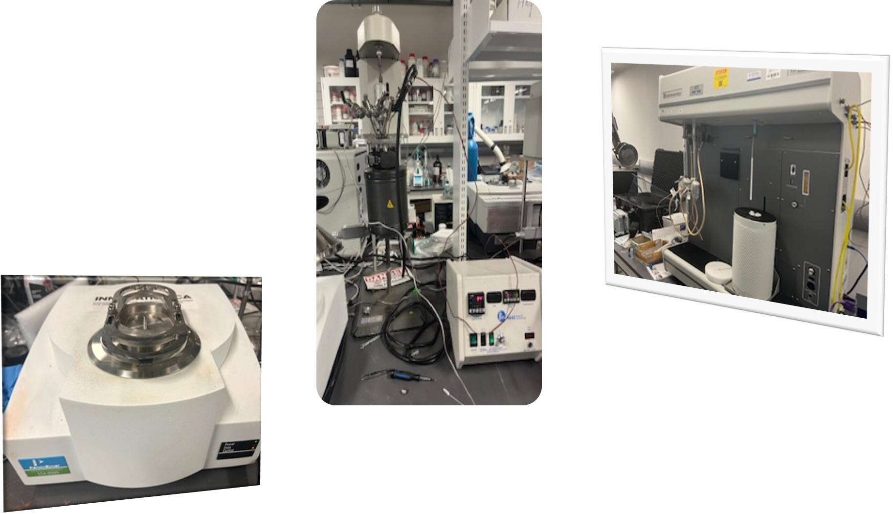

Carbon capture technologies rely on advanced porous materials, where CO₂ adsorption performance
depends on material properties and process operating conditions such as surface area, pore structure,
temperature, and pressure. Traditional experimental optimization is often time-consuming and
resource-intensive.

This project develops an <strong>AI-driven decision intelligence platform</strong> that integrates
data engineering, machine learning, peocess optimization, RAG-based scientific knowledge retrieval,
LLM reasoning, and multi-agent AI to accelerate carbon capture R&D process.

The platform transforms fragmented experimental data, scientific literature, and ML predictions
into actionable engineering insights for material discovery, process optimization, anomaly detection,
performance improvement, and next-best experiment recommendations (DOE) .

<h3>2.Key Engineering Questions</h3>

<ul>
    <li>How can experimental data, material properties, and process parameters be integrated into a unified engineering knowledge system</li>
    <li>
        How can abnormal experiments, outliers, sensor errors, and unexpected process
        behavior be detected and analyzed for root causes?
    </li>
    <li>
        Which materials, chemical modifications, and operating conditions provide the
        highest CO₂ capture performance?
    </li>
    <li>
        Why does a machine learning model generate a specific prediction, and which
        parameters control system performance?
    </li>
    <li>
        What material, reactor configuration, and operating conditions should be
        optimized for improved performance?
    </li>
    <li>
        Which experiment should be performed next to maximize research value and
        accelerate development?
    </li>
</ul>

<h3>3. Why This Platform Matters for R&D Process</h3>

This AI-driven decision intelligence platform integrates experimental data, scientific knowledge, machine learning, and engineering models to accelerate carbon capture R&D and support faster, data-driven engineering decisions.

<ul>

  <li>
    <strong>Accelerates Material Discovery:</strong>
    Machine learning models predict CO₂ adsorption performance from material properties, helping researchers identify promising materials faster and reduce experimental trial-and-error.
  </li>

  <li>
    <strong>Improves Process Optimization:</strong>
    Bayesian optimization identifies optimal operating conditions such as temperature and pressure, enabling engineers to improve capture performance while reducing testing requirements.
  </li>

  <li>
    <strong>Transforms Experimental Data into Insights:</strong>
    ETL pipelines, databases, and dashboards organize fragmented laboratory data, allowing researchers to focus on engineering analysis rather than manual data processing.
  </li>

  <li>
    <strong>Provides Explainable Engineering Decisions:</strong>
    LLM reasoning and ML interpretation explain model predictions, identify key performance factors, and increase confidence in AI-assisted decisions.
  </li>

  <li>
    <strong>Connects Research Knowledge with Experiments:</strong>
    RAG-based scientific retrieval integrates literature insights with experimental results, helping researchers leverage existing knowledge and accelerate innovation.
  </li>

  <li>
    <strong>Reduces Experimental Cost and Development Time:</strong>
    AI-guided Design of Experiments (DOE) recommends high-value experiments, minimizing unnecessary laboratory testing and resource consumption.
  </li>

  <li>
    <strong>Supports Scale-Up and Industrial Deployment:</strong>
    Combines AI predictions, optimization, and engineering analysis to bridge laboratory discoveries with practical carbon capture process development.
  </li>

  <li>
    <strong>Provides an AI Engineering Chatbot:</strong>
    A conversational AI interface allows researchers to ask technical questions, explore experimental trends, understand model results, review optimization recommendations, and receive engineering guidance through natural language interaction.
  </li>

  <li>
    <strong>Creates an Intelligent Multi-Agent Research Assistant:</strong>
    Multi-agent AI systems act as a virtual engineering team, combining data analysis, scientific reasoning, and optimization to provide faster and more informed R&D decisions.
  </li>

</ul>

<h3 align="center">AI-Driven Engineering Decision Intelligence Platform</h3>

    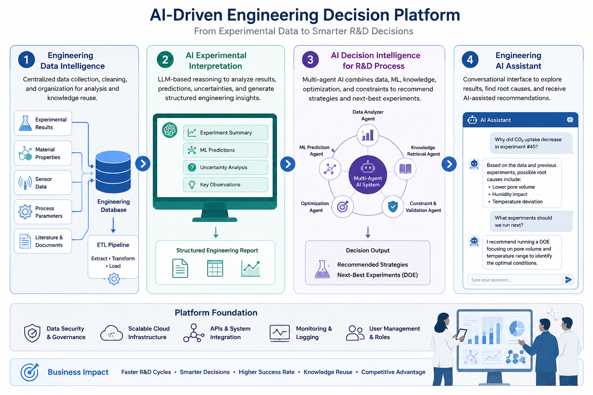

<h2>4. Deployment & Interactive Streamlit Application</h2>

The platform is deployed as an interactive <strong>Streamlit</strong> application that enables users to explore experimental data, evaluate machine learning models, predict CO₂ uptake, optimize process conditions, and generate AI-assisted engineering insights through an intuitive web interface.

<h4>Dashboard Modules</h4>

<ul>
    <li><strong>Home:</strong> Project overview and AI workflow.</li>
    <li><strong>Methodology:</strong> End-to-end system architecture.</li>
    <li><strong>Data Retrieval:</strong> Connected Streamlit to SQLite database for dynamic data loading and visualization.</li>
    <li><strong>Data Update:</strong> Added a validated input form to store new experimental records directly in the SQLite database.</li>
    <li><strong>Data Preview:</strong> Dataset exploration and statistics.</li>
    <li><strong>Model Diagnostics:</strong> Performance evaluation and hyperparameter tuning.</li>
    <li><strong>CO₂ Prediction:</strong> Predict adsorption capacity from user inputs.</li>
    <li><strong>Process Optimization & Scale up:</strong> Bayesian optimization for process and material design.</li>
    <li><strong>LLM Interpretation:</strong> Explainable engineering insights and recommendations.</li>
    <li><strong>Cheminsigth AI:</strong> Engineering chatbot with RAG-powered scientific reasoning.</li>
    <li><strong>Multi-Agent AI:</strong> Generates DOE designs, engineering recommendations, and AI chatbot assistance.</li>
    <li><strong>Engineering Reports:</strong> Automated technical report generation.</li>
</ul>

The application is currently being prepared for deployment on <strong>Streamlit Community Cloud</strong> for browser-based access.

<h3 align="center">Streamlit Application Overview</h3>

    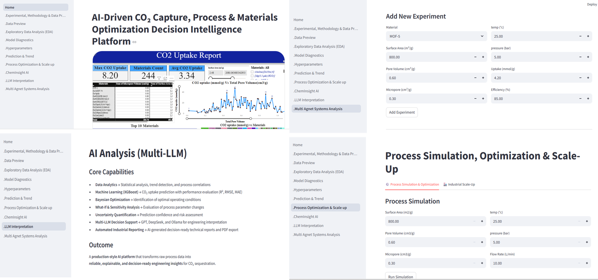

<h2>5.System Architecture</h2>

    The platform follows an end-to-end AI engineering pipeline:

<pre>
Experimental Data Sources
    |
    v
ETL Pipeline
(Python + Pandas + SQLAlchemy)
    |
    v
Engineering Knowledge Database
(SQLite + SQL Analytics)
    |
    v
Data Quality &amp; Anomaly Detection
    |
    +-------------------------------+
    |                               |
    v                               v
Outlier Detection                 Experimental Anomaly
(IQR, Z-score, ML methods)        Detection &amp; Validation
    |
    v
Clean Engineering Dataset
    |
    v
Machine Learning Prediction
(Gradient Boosting / ML Models)
    |
    v
Model Explainability
Feature Importance
    |
    v
Process &amp; Material Optimization
(Bayesian Optimization)
    |
    |
    v
Optimal Operating Conditions
(Temperature, Pressure,
Flow Rate, Material Properties)
    |
    +-------------------------------+
    |                               |
    v                               v
Scientific Knowledge Retrieval       LLM Engineering
(RAG + FAISS)                        Interpretation
    |                               |
    +---------------+---------------+
                    |
                    v
          Multi-Agent AI System
                    |
                    v
    Engineering Decision Support
      &amp; Next Best Experiment
                    |
                    v
      Technical Q&amp;A Assistant
   (Data + ML + Literature + AI Reasoning)
                    |
                    v
I   Dashboards (Power BI & Streamlit)
</pre>

<h2>6.Key Results</h2>

<ul>
    <li>
        Developed an end-to-end AI engineering platform integrating
        data engineering, machine learning, RAG, and multi-agent reasoning.
    </li>
    <li>
        Built a structured engineering database enabling historical experiment analysis
        and AI-driven knowledge reuse.
    </li>
    <li>
        Developed ML models to predict CO₂ uptake based on material and process parameters.
    </li>
    <li>
        Implemented LLM-based interpretation to automatically generate engineering insights
        from experimental and model outputs.
    </li>
    <li>
        Created an AI decision workflow capable of recommending optimization strategies
        and next experimental directions.
    </li>
    <li>
        Deployed an interactive AI engineering platform using Streamlit,
        Power BI, and Streamlit Community Cloud for web-based visualization, prediction,
        and decision support.
    </li>
</ul>

<h2>
    6.1. Results: LLM Interpretation & Multi-Agent System (DOE)
</h2>

<h3 align="center"> LLM Interpretation Results</h3>

    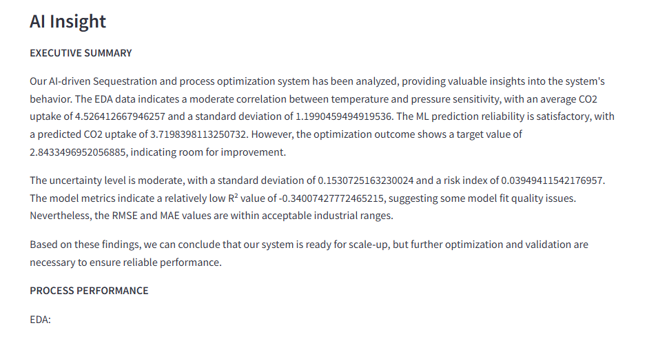
    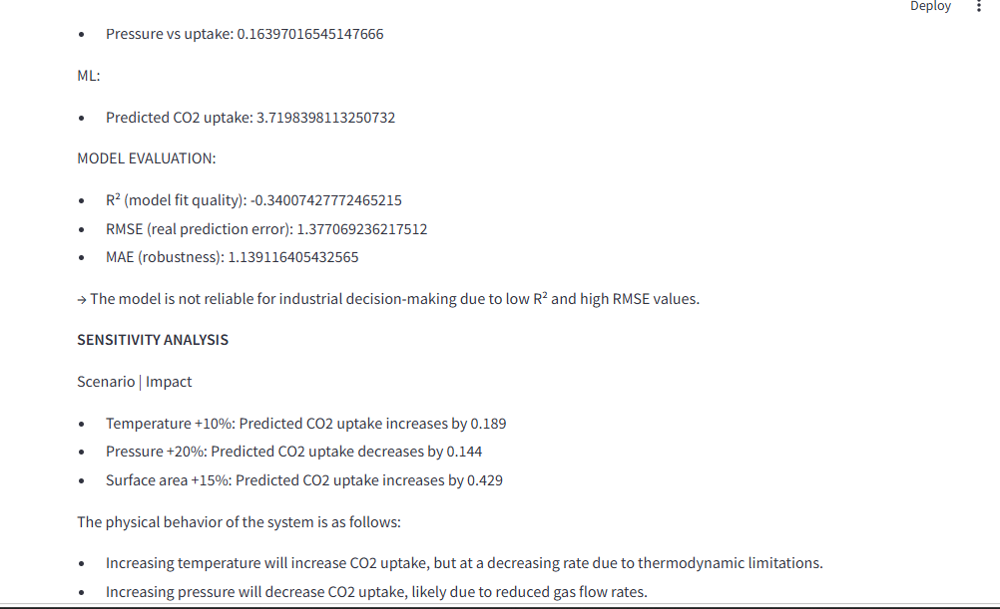
    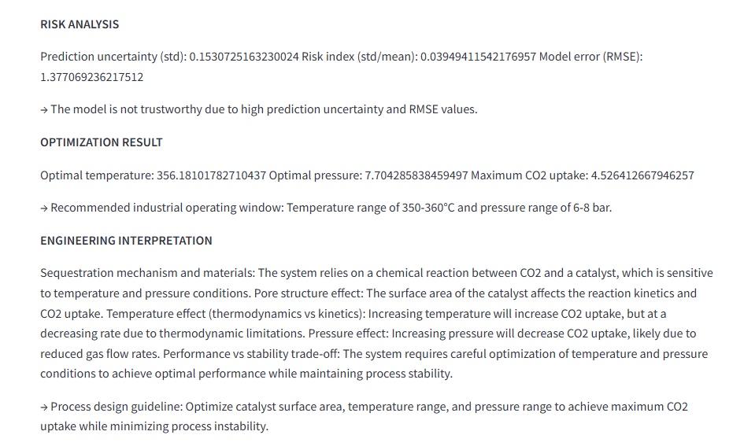

<h3 align="center"> Multi-Agent System for Design of Experiments (DOE)</h3>

    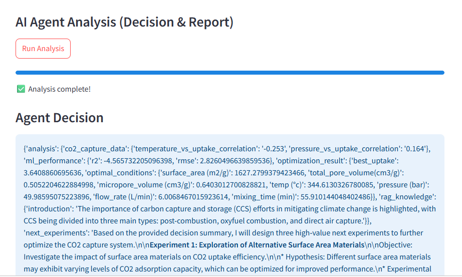
    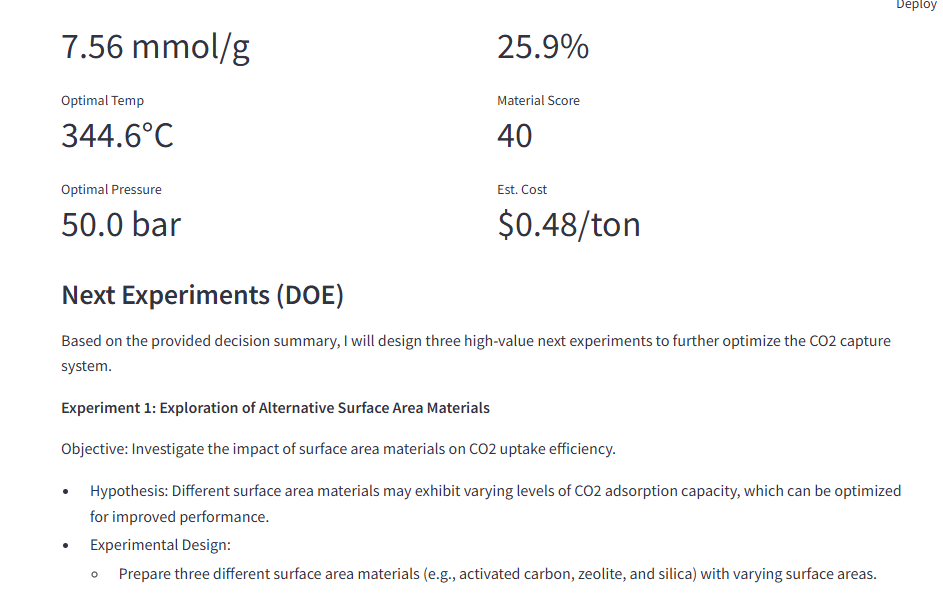
    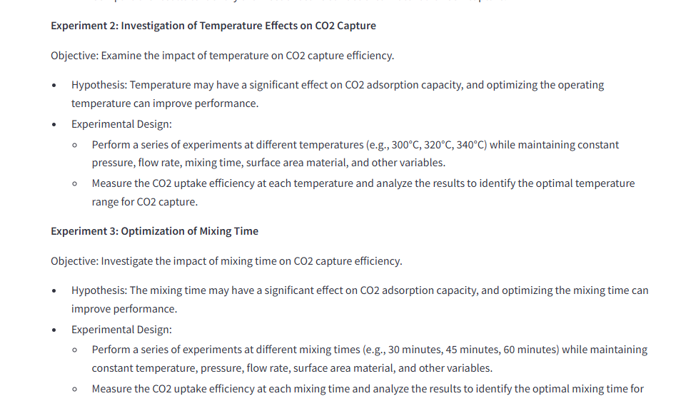

<h2>
    7.Technical Implementation
</h2>

<h2>7.1. Unified API Access to GPT and DeepSeek via OpenRouter</h2>

<pre>
<code>
load_dotenv()

OPENROUTER_API_KEY = your_openrouter_key
OPENROUTER_MODEL = openai/gpt-4o-mini
OPENROUTER_BASE_URL = https://openrouter.ai/api/v1

api_key = os.getenv("OPENROUTER_API_KEY")
model = os.getenv("OPENROUTER_MODEL")
base_url = os.getenv("OPENROUTER_BASE_URL")

client = OpenAI(
    base_url=base_url,
    api_key=api_key
)
</code>
</pre>

<h2>7.2. Data Engineering & Industrial Database Development</h2>

    

    <a href="https://youtu.be/3aY6nBX6ZKM" target="_blank">
        <button>
            ▶ Watch Data Engineering Demo Video
        </button>
    </a>

The first stage focuses on developing a reliable engineering data infrastructure that transforms
fragmented carbon capture experimental data into a structured, searchable, and AI-ready knowledge
system. The pipeline integrates experimental results, process parameters, material properties,
and operational data for machine learning, optimization, and engineering analysis.

<h3>7.2.1. ETL Pipeline Workflow</h3>

<ul>
    <li>
        <strong>Extract:</strong>
        Collects multi-source experimental data including laboratory results, sensor measurements,
        data acquisition records, process conditions, material properties, Excel, and CSV datasets.
    </li>
    <li>
        <strong>Transform:</strong>
        Performs data cleaning, missing-value handling, validation, standardization, outlier detection,
        and engineering feature preparation.
    </li>
    <li>
        <strong>Load:</strong>
        Stores processed datasets in a centralized SQLite engineering database using SQLAlchemy for
        efficient retrieval and AI model integration.
    </li>
</ul>

<pre>
def etl_pipeline(df, target_column, missing_strategy="mean", remove_cols=None):
    print(" Checking and handling missing values...")
    df_clean = handle_missing_values(df_clean, strategy=missing_strategy)

    print("\n Removing duplicates...")
    df_clean = remove_duplicates(df_clean)

    print("\n Detecting & removing outliers...")
    df_clean = remove_outliers(df_clean, target_column.lower(), plot=True)

    print("\n ETL pipeline complete.")
    return df

cleaned_df = etl_pipeline(
    df,
    target_column='CO2 uptake (mmol/g)',
    missing_strategy="mean",
    remove_cols=["gamma", "world"])
</pre>

<h3>7.2.2. Engineering Data Query & Analysis</h3>

The database enables rapid engineering exploration before applying machine learning and optimization
algorithms. SQL queries are used to identify high-performing materials, analyze process conditions,
and retrieve historical experiments.

<ul>
    <li>Ranking materials based on CO₂ uptake performance.</li>
    <li>Analyzing the influence of temperature, pressure, and material properties.</li>
    <li>Retrieving previous experiments for knowledge reuse and optimization.</li>
</ul>

    <strong>1. Identify highest-performing materials:</strong>

<pre>
SELECT
    material_name,
    AVG(co2_uptake) AS avg_uptake
FROM experiments
GROUP BY material_name
ORDER BY avg_uptake DESC
LIMIT 10;
</pre>

    <strong>2. Find best experimental conditions:</strong>

<pre>
SELECT *
FROM process_data
ORDER BY co2_uptake DESC
LIMIT 10;
</pre>

<h3>SQLAlchemy Integration</h3>

<pre>
from sqlalchemy import create_engine

engine = create_engine(
    "sqlite:///carbon_capture.db")

df.to_sql(
    "experiments",
    engine,
    if_exists="replace",
    index=False)
</pre>

<h3>7.2.3. Streamlit–SQLite Integration</h3>

<ul>
    <li>
        <strong>Dynamic Data Retrieval:</strong>
        Connected Streamlit with SQLite to load, query, and visualize experimental datasets
        through an interactive interface.
    </li>
    <li>
        <strong>Experimental Data Update:</strong>
        Developed a validated Streamlit input form that allows users to enter new experimental conditions
        (e.g., temperature, pressure, flow rate, material information) and automatically store new records
        back into the SQLite database.
    </li>
    <li>
        <strong>Continuous Dataset Expansion:</strong>
        Enables a closed-loop workflow where new experimental results continuously improve future analysis
        and machine learning development.
    </li>
</ul>

<pre>
<code>
@st.cache_data
def load_database():
    conn = sqlite3.connect(DB_PATH)
    df = pd.read_sql(f"SELECT * FROM {TABLE_NAME}", conn)
    conn.close()
    return df
</code>
</pre>

<h3 align="center">Streamlit–SQLite Database Integration</h3>

    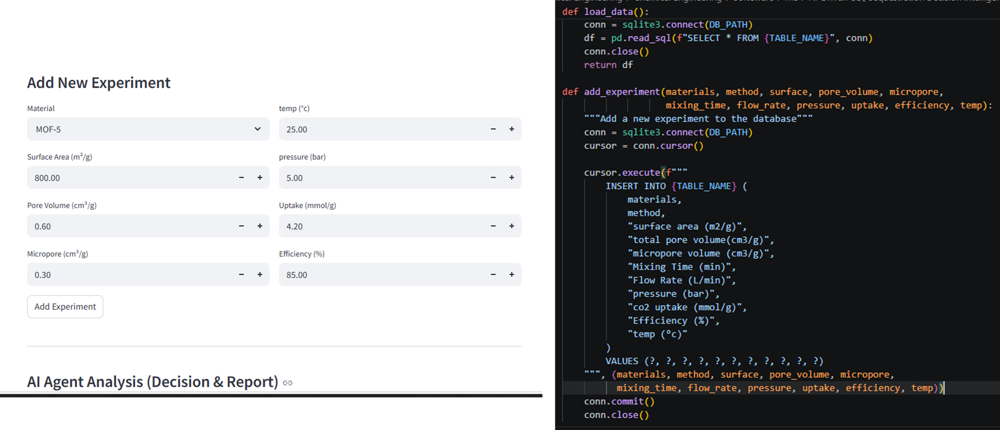

<h4>Technical Advantages</h4>

<ul>
    <li>
        <strong>Centralized Engineering Knowledge:</strong>
        Transforms scattered experimental data into a structured and reusable database.
    </li>
    <li>
        <strong>AI-Ready Data Pipeline:</strong>
        Provides clean and validated datasets for machine learning and optimization workflows.
    </li>
    <li>
        <strong>Interactive Data Management:</strong>
        Allows engineers to explore existing data and continuously add new experimental results without
        manual database modification.
    </li>
    <li>
        <strong>Scalable Architecture:</strong>
        Provides a foundation for future integration with industrial databases, real-time sensors, and
        cloud-based data platforms.
    </li>
</ul>

<h2>7.3. Machine Learning Model Development & Prediction</h2>

    

    <a href="https://youtu.be/ZD384ylmRS4" target="_blank">
        ▶ Watch Machine Learning Prediction Demo
    </a>

This module integrates machine learning models into the Streamlit platform to predict CO₂ uptake
performance based on material properties and operating conditions. The objective is to replace
time-consuming trial-and-error experiments with data-driven prediction and engineering analysis.

    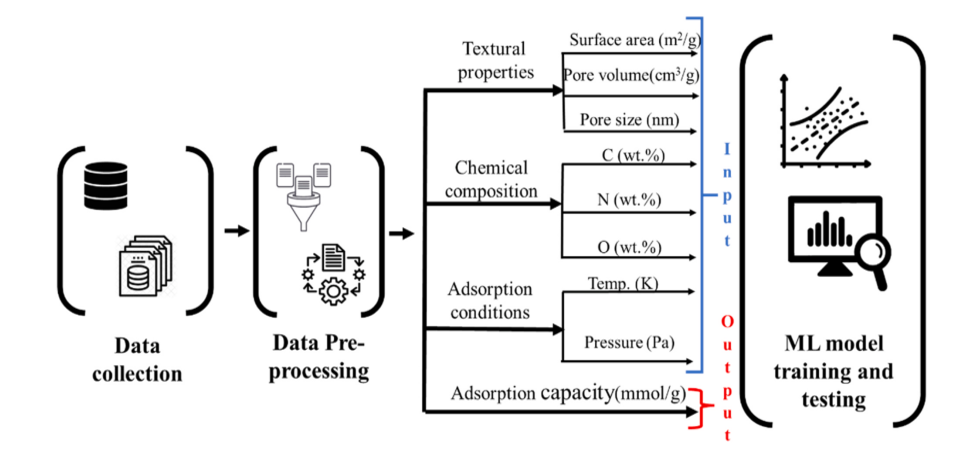

<h4>Technical Workflow</h4>

<ul>
    <li>
        <strong>Automated Data Preprocessing:</strong>
        Develops a reproducible pipeline for data cleaning, missing value handling, and preparation of
        experimental datasets for machine learning.
    </li>
    <li>
        <strong>Feature Engineering & Transformation:</strong>
        Processes numerical and categorical variables using Scikit-learn pipelines and ColumnTransformer
        to improve model reliability.
    </li>
    <li>
        <strong>Predictive Model Development:</strong>
        Evaluates multiple regression algorithms to identify the most effective approach for CO₂ uptake prediction.
    </li>
    <li>
        <strong>Model Optimization & Validation:</strong>
        Applies hyperparameter tuning and K-Fold cross-validation to improve model performance and ensure
        generalization capability.
    </li>
    <li>
        <strong>Explainable ML Analysis:</strong>
        Uses feature importance analysis to identify the impact of material properties and process parameters
        on CO₂ adsorption performance.
    </li>
</ul>

<h4>Streamlit-Based Prediction Interface</h4>

The trained ML model is integrated into the Streamlit application, allowing users to enter new
experimental conditions, predict CO₂ uptake, and continuously expand the dataset by storing new
experimental results in the SQLite database.

<h3 align="center">CO₂ Uptake Prediction & New Experimental Data Entry</h3>

    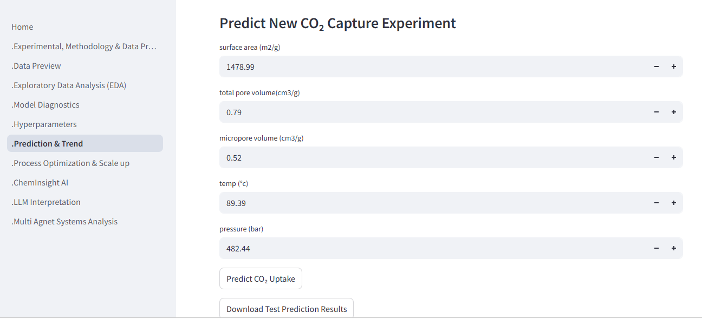

<h4>Technical Advantages</h4>

<ul>
    <li>
        <strong>Data-Driven Prediction:</strong>
        Provides rapid CO₂ uptake estimation without requiring additional experimental runs.
    </li>
    <li>
        <strong>Interactive Model Evaluation:</strong>
        Enables engineers to test different input conditions and analyze prediction behavior.
    </li>
    <li>
        <strong>Continuous Dataset Improvement:</strong>
        Allows new experimental results to be collected through Streamlit and stored directly in SQLite
        for future model development.
    </li>
    <li>
        <strong>Engineering Decision Support:</strong>
        Creates a connection between experimental data, ML predictions, and optimization workflows.
    </li>
</ul>

<strong>Note:</strong>
For additional technical details, implementation examples, and complete source code,
please refer to the ML CO₂ Prediction module in the corresponding repository files.

<h2>7.4. Process Optimization & Scale-Up Assessment</h2>

    

    <a href="https://youtu.be/OcEckD-TYeM" target="_blank">
        ▶ Watch Process Optimization & Scale-Up Demo
    </a>

This Streamlit module extends the platform from prediction to engineering decision support by integrating
machine learning models, optimization algorithms, uncertainty analysis, and engineering intelligence.
It enables users to evaluate process behavior, identify optimal operating conditions, analyze performance
limitations, and assess scale-up opportunities for CO₂ capture systems.

<h4>Technical Advantages</h4>

<ul>
    <li>
        <strong>Interactive Process Analysis:</strong>
        Enables engineers to perform what-if analysis, sensitivity analysis, and uncertainty evaluation
        to understand the impact of operating parameters on CO₂ capture performance.
    </li>
    <li>
        <strong>AI-Based Process Optimization:</strong>
        Uses predictive models and Bayesian optimization to identify improved material and operating conditions,
        reducing experimental trial-and-error.
    </li>
    <li>
        <strong>Engineering Decision Support:</strong>
        Combines ML predictions, optimization results, and engineering constraints to generate practical
        recommendations for process improvement.
    </li>
    <li>
        <strong>Preliminary Scale-Up Assessment:</strong>
        Provides initial evaluation of reactor requirements, process conditions, and industrial feasibility
        based on laboratory-scale experimental data.
    </li>
    <li>
        <strong>Streamlit Interactive Deployment:</strong>
        Provides a user-friendly interface where engineers can modify inputs, visualize results, and explore
        optimization scenarios without directly interacting with the underlying code.
    </li>
</ul>

<h3 align="center">Process Optimization & Scale-Up Workflow</h3>

<pre>
Experimental Data
    |
    v
ML Prediction Model
    |
    +----------------+
    |                |
    v                v
Sensitivity        Uncertainty
Analysis           Evaluation
    |
    v
Bayesian Optimization
    |
    v
Engineering Recommendations
    |
    v
Scale-Up Assessment
</pre>

The integration of prediction, optimization, and interactive engineering analysis transforms the
Streamlit application from a visualization tool into an AI-assisted decision platform for accelerating
CO₂ capture research and process development.

<h3>7.5. Scientific Knowledge Integration Using RAG (ChemInsight AI)</h3>

    

    <a href="https://youtu.be/cjApeyFeX0g" target="_blank">
        ▶ Watch ChemInsight AI Demo
    </a>

Experimental data provides quantitative performance information; however, critical engineering
knowledge is also distributed across scientific papers, technical reports, SOPs, and research
documents. ChemInsight AI addresses this challenge by integrating external scientific knowledge
with experimental analysis through a Retrieval-Augmented Generation (RAG) framework.

ChemInsight AI is an LLM-powered scientific assistant that enables engineers to search, summarize,
and interpret technical documents while connecting literature insights with carbon capture
experimental results.

<h4>ChemInsight AI Workflow</h4>

<pre>
Scientific Documents
(PDF / DOCX / TXT)
    |
    v
Document Extraction
(PyPDF2 / python-docx)
    |
    v
Text Chunking
(LangChain Recursive Splitter)
    |
    v
Embedding Generation
(Hugging Face Sentence Transformers)
    |
    v
FAISS Vector Database
    |
    v
Semantic Retrieval
    |
    v
LLM Reasoning
(GPT-4o-mini / DeepSeek)
    |
    v
Scientific Insights & Engineering Answers
</pre>

<h4>Technical Implementation</h4>

<ul>
    <li>
        <strong>Document Processing:</strong>
        Automatically extracts and preprocesses scientific content from PDF, DOCX, and TXT files.
    </li>
    <li>
        <strong>Semantic Search:</strong>
        Converts document chunks into vector embeddings and performs similarity-based retrieval using FAISS.
    </li>
    <li>
        <strong>Context-Aware Generation:</strong>
        Uses retrieved document context with LLM reasoning to generate grounded technical responses.
    </li>
    <li>
        <strong>Knowledge Integration:</strong>
        Connects scientific literature, SOPs, technical documents, and experimental results into a unified
        engineering knowledge system.
    </li>
</ul>

<h4>Technical Advantages</h4>

<ul>
    <li>
        <strong>Reduced Information Search Time:</strong>
        Enables engineers to quickly retrieve relevant scientific knowledge without manually reviewing
        large document collections.
    </li>
    <li>
        <strong>Improved Response Accuracy:</strong>
        Grounds LLM responses in retrieved documents, reducing unsupported answers and hallucinations.
    </li>
    <li>
        <strong>Scalable Knowledge Base:</strong>
        Allows new documents to be added and indexed without retraining the language model.
    </li>
    <li>
        <strong>Engineering Decision Support:</strong>
        Provides scientific explanations and connects literature knowledge with experimental analysis.
    </li>
</ul>

<h3 align="center">ChemInsight AI Results</h3>

    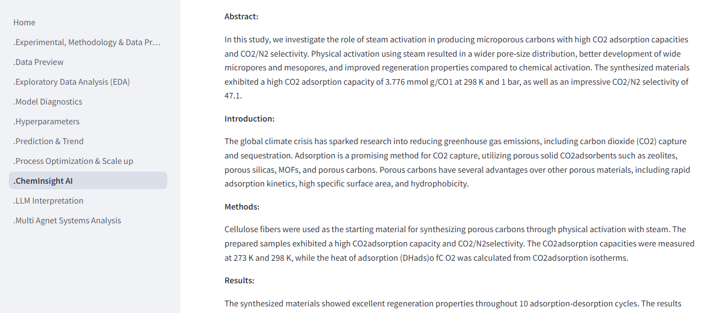

<h2>7.6. LLM-Based Experimental Result Interpretation</h2>

    

    <a href="https://youtu.be/2d4F-jbgX9E" target="_blank">
        ▶ Watch LLM Engineering Interpretation Demo
    </a>

Machine learning models generate predictions, trends, and optimization results; however,
converting these outputs into engineering decisions requires domain-specific interpretation.
This module introduces an LLM-based reasoning layer that transforms analytical outputs into
structured engineering insights and recommendations.

The system integrates experimental data analysis, ML predictions, uncertainty evaluation,
what-if analysis, and Bayesian optimization results into a structured context that is analyzed
by LLM models (GPT / DeepSeek / Local LLM).

<h3>Technical Approach</h3>

<ul>
    <li>
        <strong>LLM Function Calling Architecture:</strong>
        Instead of providing raw datasets directly to the LLM, analytical functions are created as
        independent tools. The LLM dynamically accesses these functions to retrieve validated
        engineering information before generating recommendations.
    </li>
    <li>
        <strong>Engineering Analysis Functions:</strong>
        <ul>
            <li><strong>EDA Function:</strong> Provides statistical analysis, trends, and parameter correlations.</li>
            <li><strong>ML Prediction Function:</strong> Provides CO₂ uptake predictions and model performance metrics.</li>
            <li><strong>Uncertainty Function:</strong> Evaluates prediction confidence and reliability.</li>
            <li><strong>What-If Analysis:</strong> Evaluates the impact of changing operating parameters.</li>
            <li><strong>Optimization Function:</strong> Provides optimal operating conditions using Bayesian optimization.</li>
        </ul>
    </li>
</ul>

<h3>Engineering Interpretation Workflow</h3>

<pre>
Experimental Results
    |
    v
Engineering Database
    |
    v
Analytical Functions
(EDA + ML + Uncertainty + Optimization)
    |
    v
Structured JSON Context
    |
    v
LLM Function Calling
(GPT / DeepSeek / Local LLM)
    |
    v
Engineering Interpretation Report
</pre>

<h3>Core Implementation</h3>

<pre>
<code>
# Generate analytical results
payload = {
    "EDA": run_eda(df),
    "Prediction": predict(model, inputs),
    "Uncertainty": uncertainty(model, inputs),
    "WhatIf": what_if(model, inputs),
    "Optimization": optimize(model),
    "ModelMetrics": {
        "R2": r2,
        "RMSE": rmse,
        "MAE": mae}}

# Send structured engineering context to LLM
report = call_llm(provider="gpt", prompt=build_prompt(payload))
</code>
</pre>

<h3>Engineering Interpretation Prompt</h3>

<pre>
You are a senior CO₂ capture process engineer.

Analyze the following structured experimental results:

{JSON_ANALYTICAL_OUTPUT}

Generate an engineering report including:

1. Performance Analysis
- Explain CO₂ uptake behavior and key observations.

2. Parameter Influence
- Identify important effects of temperature,
  pressure, and material properties.

3. Model Reliability
- Interpret prediction accuracy,
  uncertainty, and risk level.

4. Optimization Recommendation
- Explain optimal operating conditions
  and suggest next experiments.

5. Engineering Conclusion
- Provide practical recommendations
  for process improvement.

Rules:
- Use only the provided data.
- Do not generate unsupported information.
- Focus on engineering decisions.
</pre>

<h3>Advantages</h3>

<ul>
    <li>
        <strong>Explainable AI Decision Support:</strong>
        Transforms complex ML outputs into understandable engineering insights.
    </li>
    <li>
        <strong>Reduced Analysis Time:</strong>
        Automates interpretation of multiple analytical results from databases and AI models.
    </li>
    <li>
        <strong>Integrated Engineering Reasoning:</strong>
        Connects experimental data, predictive models, optimization results, and domain knowledge.
    </li>
    <li>
        <strong>Improved R&D Decision Making:</strong>
        Provides recommendations for process improvement and future experimental directions.
    </li>
</ul>

<h3 align="center">LLM Interpretation Results</h3>

    
    
    

<h1>7.7. AI Multi-Agent Decision Intelligence Engine</h1>

    

    <a href="https://youtu.be/YAbMhKLr5-4" target="_blank">
        ▶ Watch Multi-Agent AI Decision Intelligence Demo
    </a>

This layer represents the intelligence core of the platform. The objective was to move beyond
traditional machine learning prediction and develop an <strong>AI engineering assistant</strong>
capable of combining experimental data, ML predictions, scientific knowledge, optimization
results, and engineering constraints into actionable decisions.

The multi-agent framework mimics an engineering team where specialized AI agents collaborate
through an orchestration layer to analyze performance, identify improvement opportunities,
recommend experiments, and support scale-up decisions.

<h2>Why Multi-Agent AI?</h2>

A single ML model can predict CO₂ uptake and identify important parameters; however, engineering
decision-making requires additional reasoning:

<ul>
    <li>Why did performance increase or decrease?</li>
    <li>Which material or condition should be investigated next?</li>
    <li>What operating conditions should be optimized?</li>
    <li>Is the process reliable for scale-up?</li>
</ul>

The multi-agent architecture solves this challenge by assigning different engineering tasks to
specialized AI agents and combining their outputs into a final decision workflow.

<h2> Multi-Agent Architecture</h2>

<pre>
                                  USER
                                    │
                                    ▼
                         Streamlit Web Interface
                                    │
                                    ▼
                         User Query / Experiment
                                    │
                                    ▼
                    Multi-Agent Orchestrator (ReAct)
             LangChain Agent + ChatOpenAI + AgentExecutor
                                    │
        ────────────────────────────┼────────────────────────────
        │                           │                           │
        ▼                           ▼                           ▼
 Tool Calling                Reasoning Engine             Agent Memory
 (LangChain Tools)            (LLM Planner)              Tool Registry
        │                           │                           │
        │                           │                           │
 ┌──────┼──────────┬──────────┬─────┴─────┬───────────────┐
 ▼      ▼          ▼          ▼           ▼               ▼
EDA   Prediction  Optimization  Reactor  Scientific RAG  Database
Tool    Tool       Tool          Tool      Tool          Tool
 │        │           │            │          │             │
 │        │           │            │          │             │
 ▼        ▼           ▼            ▼          ▼             ▼
SQLite  ML Model  Bayesian     Engineering  FAISS      Experiment
Dataset XGBoost  Optimization  Simulation  Vector DB    Storage
                         │
                         ▼
                 Decision Engine (LLM)
                         │
         ┌───────────────┼────────────────┐
         ▼               ▼                ▼
 Root Cause       Risk Assessment     Next Experiment
                         │
                         ▼
             DOE Generator (LLM Planning)
                         │
                         ▼
          Industrial Decision Intelligence
                         │
                         ▼
      PDF Report + Dashboard + Chat Response
</pre>

<h2>AI-Driven Experimental Design and Optimization</h2>

The platform enables a transition from traditional trial-and-error experimentation to
<strong>AI-guided experimental strategy</strong>.

The DOE agent recommends experiments by considering:

<ul>
    <li>Prediction uncertainty</li>
    <li>Optimal operating regions</li>
    <li>Material properties</li>
    <li>Scientific mechanisms</li>
    <li>Industrial constraints</li>
</ul>

<h3>Chemical Engineering AI Agent Implementation</h3>

<pre>
<code>
CHEMICAL_ENGINEERING_PROMPT = """

You are a Senior Chemical Engineering AI Agent
specialized in CO₂ capture.

Expertise:
- Adsorption thermodynamics and kinetics
- CO₂ capture materials
- Reactor design
- Process optimization
- Scale-up assessment

Capabilities:
- Analyze experimental data
- Interpret ML predictions
- Recommend optimal conditions
- Explain engineering mechanisms

Rules:
- Use chemical engineering principles
- Provide quantitative recommendations
- Suggest experiments when required

"""

agent = create_react_agent(
    llm,
    tools,
    prompt=CHEMICAL_ENGINEERING_PROMPT)

result = agent_executor.invoke({
    "input": engineering_question})
</code>
</pre>

<h3>AI-Driven DOE Experiment Recommendation</h3>

<pre>
<code>
def next_experiment_suggestion(
        decision_data,
        optimal_conditions):

    prompt = f"""

    Design next CO₂ capture experiments based on:

    - ML predictions
    - Optimization results
    - Uncertainty analysis
    - Engineering constraints

    Include:

    - Condition refinement
    - Robustness testing
    - Material exploration
    - Expected performance
    - Engineering justification

    """

    response = llm.generate(prompt)

    return response
</code>
</pre>

<h3 align="center">Multi-Agent AI System Results</h3>

    
    
    

<h2>AI Engineering Chatbot</h2>

The platform provides a conversational engineering assistant that connects users with AI agents
and analytical tools. The chatbot can answer project-related technical questions, interpret
ML results, explain performance limitations, and recommend improvement strategies.

<ul>
    <li>Explain CO₂ uptake prediction results</li>
    <li>Analyze performance improvement opportunities</li>
    <li>Recommend optimization strategies</li>
    <li>Answer questions about project methodology</li>
    <li>Suggest future experimental directions</li>
</ul>

<h3 align="center">AI Chatbot Interface</h3>

    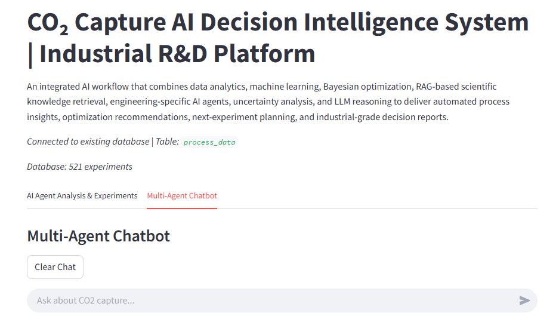

<h2>8. Power BI Dashboard – Engineering Analytics</h2>

An interactive <strong>Power BI engineering analytics dashboard</strong> was developed to
visualize and analyze experimental CO₂ capture data. The dashboard transforms raw
experimental datasets into engineering insights by enabling researchers to monitor
performance indicators, investigate material behavior, and identify optimization
opportunities.

The dashboard provides data-driven analysis of material properties, operating conditions,
and CO₂ uptake performance. Engineers can explore relationships between pore structure,
surface area, process parameters, and adsorption capacity using interactive filtering,
drill-down analysis, and dynamic visualizations.

<h3 align="center">Power BI Dashboard</h3>

    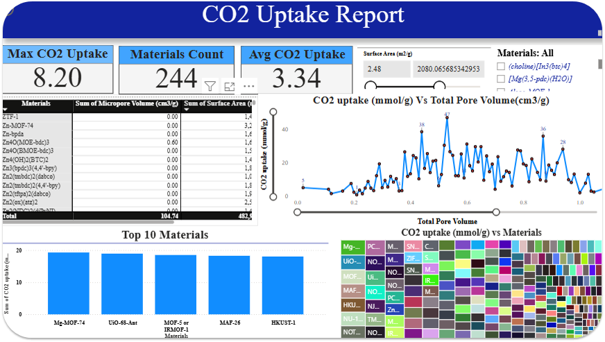

<h3>Dashboard Capabilities</h3>

<ul>
    <li>
        <strong>Performance Monitoring:</strong>
        Tracks key CO₂ uptake indicators and experimental performance metrics.
    </li>
    <li>
        <strong>Material Analysis:</strong>
        Compares material families and identifies high-performing adsorption materials.
    </li>
    <li>
        <strong>Feature Relationship Analysis:</strong>
        Evaluates correlations between pore volume, surface area, operating conditions,
        and CO₂ adsorption capacity.
    </li>
    <li>
        <strong>Data Quality Analysis:</strong>
        Supports distribution analysis, anomaly detection, and experimental data validation.
    </li>
    <li>
        <strong>Interactive Engineering Exploration:</strong>
        Provides dynamic filtering and drill-down capabilities for rapid investigation of
        experimental trends.
    </li>
    <li>
        <strong>Decision Support:</strong>
        Helps identify promising materials and operating conditions for future optimization
        and experimental planning.
    </li>
</ul>

<h2>9. Future Improvements</h2>

<ul>
    <li>
        <strong>Autonomous ETL & Data Streaming:</strong>
        Develop scalable data pipelines using automated ETL workflows and streaming technologies
        such as Apache Kafka for continuous experimental and industrial data integration.
    </li>
    <li>
        <strong>Real-Time Industrial Data Integration:</strong>
        Connect IoT sensors, data acquisition systems, and industrial monitoring platforms to enable
        continuous process analysis and real-time decision support.
    </li>
    <li>
        <strong>Cloud-Based AI Deployment:</strong>
        Deploy the platform on AWS/Azure infrastructure to improve scalability, accessibility,
        computational performance, and industrial deployment capability.
    </li>
    <li>
        <strong>AI Chatbot Optimization:</strong>
        Improve chatbot response speed, retrieval accuracy, and technical reasoning capability
        through optimized RAG pipelines, vector databases, and LLM inference strategies.
    </li>
    <li>
        <strong>Digital Twin & Industrial Scale-Up:</strong>
        Integrate process simulation tools such as Aspen HYSYS, reactor modeling, CFD simulations,
        and techno-economic analysis for advanced process optimization and scale-up assessment.
    </li>
    <li>
        <strong>Advanced AI Optimization:</strong>
        Implement reinforcement learning and long-term agent memory to enable continuous learning,
        adaptive optimization, and R&D knowledge management.
    </li>
</ul>

<h2>10. Industrial Scale-Up Intelligence</h2>

The platform extends beyond laboratory-scale prediction by connecting experimental results
with engineering scale-up methodologies. Future development will focus on translating
material performance and process optimization results into industrial deployment scenarios.

<h3>Future Scale-Up Capabilities</h3>

<ul>
    <li>
        <strong>Process Simulation:</strong>
        Integration with chemical process simulation tools such as Aspen HYSYS for industrial
        process evaluation.
    </li>
    <li>
        <strong>Reactor Modeling:</strong>
        Development of reactor models and CFD-based analysis for performance optimization.
    </li>
    <li>
        <strong>Industrial Scenario Evaluation:</strong>
        Assessment of operating conditions, capacity requirements, and process limitations.
    </li>
    <li>
        <strong>Techno-Economic Analysis:</strong>
        Evaluation of CAPEX/OPEX, energy consumption, and economic feasibility.
    </li>
</ul>

<h2>11. Technical Skills and Technologies</h2>

<ul>
    <li>
        <strong>Programming & Data Engineering:</strong>
        Python, SQL, SQLite, Pandas, NumPy, ETL Pipelines, SQLAlchemy
    </li>
    <li>
        <strong>Machine Learning & AI:</strong>
        Scikit-learn, TensorFlow, Regression Models, Feature Engineering,
        Model Validation, Explainable AI
    </li>
    <li>
        <strong>Optimization & Decision Intelligence:</strong>
        Bayesian Optimization, Design of Experiments (DOE),
        Sensitivity Analysis, Uncertainty Quantification
    </li>
    <li>
        <strong>LLM & Agentic AI:</strong>
        LangChain, OpenAI API, DeepSeek, Ollama, Prompt Engineering,
        Function Calling, Multi-Agent Systems
    </li>
    <li>
        <strong>Retrieval-Augmented Generation:</strong>
        FAISS Vector Database, HuggingFace Embeddings,
        Scientific Document Retrieval, Semantic Search
    </li>
    <li>
        <strong>Chemical Engineering Applications:</strong>
        CO₂ Capture, Adsorption Systems, Porous Materials,
        Reactor Engineering, Process Optimization, Scale-Up Methodology
    </li>
    <li>
        <strong>Deployment & Visualization:</strong>
        Streamlit, Power BI, Interactive Dashboards,
        Automated Engineering Reports
    </li>
</ul>

<h2>12. Engineering Impact and Conclusion</h2>

This AI-driven decision intelligence platform integrates experimental databases,
machine learning models, optimization algorithms, Design of Experiments (DOE),
scientific knowledge retrieval, and LLM-based reasoning into a unified engineering
decision-support framework.

The platform enhances engineering decision-making by transforming raw experimental
data and model outputs into actionable recommendations. It enables process
optimization through Bayesian optimization, sensitivity analysis, and DOE-based
experimental design to identify optimal operating conditions, prioritize high-value
experiments, and reduce trial-and-error development cycles.

By combining predictive analytics with anomaly detection and uncertainty evaluation,
the system helps engineers identify abnormal experimental behavior, diagnose
potential performance limitations, and improve process reliability. Automated
engineering reports summarize key trends, model interpretations, optimization
results, and recommended actions to support faster and more informed technical
decisions.

The integrated AI engineering chatbot provides an interactive interface for exploring
the system, allowing engineers to ask technical questions about material performance,
process behavior, ML predictions, optimization strategies, abnormal conditions, and
future experimental design recommendations. This improves system understanding and
enables efficient knowledge transfer between data, models, and engineering expertise.

By combining data engineering, machine learning, RAG-based scientific intelligence,
multi-agent AI reasoning, and engineering optimization, this framework demonstrates
how artificial intelligence can act as an engineering assistant to accelerate
research and development, improve process performance, and support the transition
from laboratory-scale experiments toward industrial carbon capture and energy
technologies.

